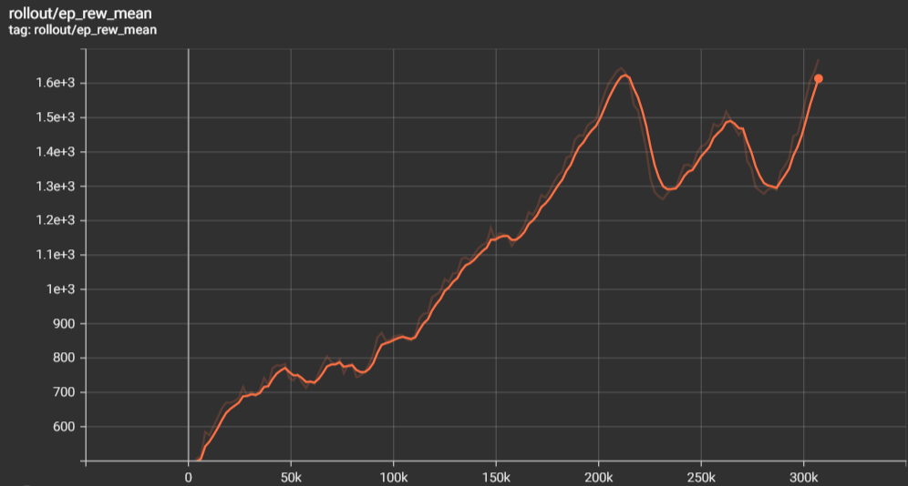

# Mario RL
This is my first personal project in [Reinforcement Learning](https://en.wikipedia.org/wiki/Reinforcement_learning), which is a way to build a self-learning AI to play in an environment. For this project, the current environment is the classic Mario NES 1-1 provided by this [pip install](https://pypi.org/project/gym-super-mario-bros/). I used a Proximal Policy Optimization with the [stable baselines 3 library](https://stable-baselines3.readthedocs.io/en/master/). Although many people have made a similar project, I have not seen one that uses the stable baseline's PPO algorithm (some even uses other RL methods like DDQN), which is why I want to try using it. I am glad that it finally works. Most importantly, I have learned a lot along the way.

## Results
At the end of training, I got an agent that could get an average reward of $1600$. From manual testing, it usually gets a total reward of $3000$. The graph below shows the progress of the agent as it learns.  
  

And this is a sample of a game that the agent wins.  
  

## Struggles
I started this project a week ago and focused on it for a week by the time I wrote this. It is really challenging to built the RL agent. One of the reasons is due to the sensitivity of PPO to hyperparameter. I tried changing a lot of things including:
- Wrappers: I tried some other things that were not used in the end such as TimeLimitWrapper, NoopResetEnv, NormalizeWrapper, CustomReward, etc
- Hyperparameters: Most notably n_steps, batch_size, learning_rate, ent_coef, n_epochs, and gamma.
- CNN model: I tried a deeper layer, but failed. I also tried using dropout and normalization until I researched that adding those to RL would hurt more than it helps the agent.  

Before succeeding this version, I tried the v3 version which is the pixelated version. This version is easier for the RL agent to learn since the sprites are simpler. (everything is in blocks) I suggest that you try this first before the original version.  
On the failed attempts, the agent struggles a lot on pitfalls (maybe since they appear lesser) and the first pipes. (since the agent needs to learn to 'hold' jump)
It is also very common for the agent to learn well in the beginning before drastically decreasing its performance. (Watching the graph is like seeing the stock rising and falling)

## File Details
- To run everything, make sure that all the pip requirement from `requirements.txt` is satified.
- You can use the `train-mario.py` to train the agent on your own. You can also change the number of timesteps.  
- You can see the whole training statistics by running a tensorboard on the folder `mario-tensorboard`.  
- To test it, run the `test-mario.py` file. By default if runs $N=10$ tries that the agent plays and gives the overall average. (change the $N$ as you see fit)  
- Finally, you can see the test result as GIF on the folder `demo`.

## Implementation Details
### Training Setup
I ran the training on a RTX-3090 GPU. The number of training timesteps I used is $300k$ timesteps with a saving checkpoint interval of $50k$. It took the GPU only $90$ minutes to finish.
### Wrappers
I used a total on $6$ wrappers to help increase the training convergence. Wrappers are functions that modifies the observations, actions and rewards. The list below explains each of the wrappers functionality.
- `ResizeObservation`: Used to resize the observation to a smaller and square shape. In this case, I reshape the observation to an 84x84 array. This is to reduce the amount of time needed for the CNN to train.
- `GrayScaleObservation`: Used to change an RGB image to a black and white image. This is so that the image only uses $1$ channnel which is necessary for frame stacking.
- `FrameStack`: Used to gather $N$ frames behind as the a collection of observations. This will be merged as different channels. In this case i used $N=4$.
- `MaxAndSkipEnv`: Used to reduce the length of an episode so the agent will make actions only on every $4$ frames. The action will be used until a new action is overwriting it.
- `JoypadSpace`: Used to limit the number of possible actions. This is so that the agent does not do weird things (including using the pipe shortcut) and focus on beating the level. In this case the possible actions are moving right, jumping right and standing still.
- `EpisodicLifeEnv`: Used to reset environment after losing a life. Usually the agent resets after all $3$ lives are spent. Using this wrapper improves training.

### Hyperparameters
After trying out a lot (and I mean A LOT) of combinations of hyperparameters, these are the hyperparameters that works for me:
- `n_steps`: 2048
- `batch_size`: 32
- `gamma`: 0.9
- `learning_rate`: 0.00025
- `ent_coef`: 0.01
- `n_epochs`: 20

### CNN Feature Extractor
It is impossible to store every different possible image pixels. Instead, I used a [Convolutional Neural Network](https://en.wikipedia.org/wiki/Convolutional_neural_network) to transform the 2d image pixels into an array of $512$ float numbers. From here, the agent will process it again to get the probabilities of actions, taking the highest value probability as an action. The details of the CNN layers are as follows.
- `2d Conv Layer` (in_channels:num_inputs, out_channels:32, kernel_size:8, stride:4, activation: ReLu)
- `Max Pool Layer` (2x2)
- `2d Conv Layer` (in_channels:32, out_channels:64, kernel_size:4, stride:2, activation: ReLu)
- `2d Conv Layer` (in_channels:64, out_channels:64, kernel_size:3, stride:1, activation: ReLu)
- `Flatten Layer`
- `Linear Layer` (in_features:n_flatten, out_features:features_dim)
The whole CNN is built using [torch](https://pytorch.org/) library with the default Adam optimizer.

## Future Improvements
- Currently, the agent still struggles to consistently beat the world. In the future, I would like to make it consistently beat it.
- Make the agent train on several levels aside from 1-1. Some levels are more tricky to win.
- Make my own PPO without stable baseline's library. I want to try several interesting tricks that are not implemented in stable baselines.
